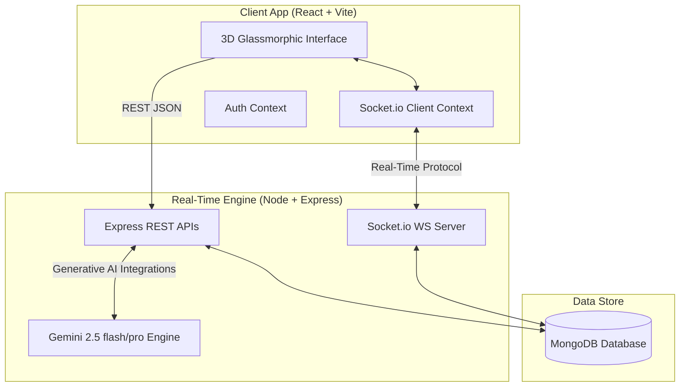

# 🏆 AUCTION-PRO — Real-Time Sports Player Auction Platform

<div align="center">
  
  [](https://github.com/yogeshswami0/Auction)
  [](https://socket.io/)
  [](https://deepmind.google/technologies/gemini/)
  [](https://github.com/yogeshswami0/Auction)
  
</div>

---

## 📖 Project Overview

**AUCTION-PRO** is a premium, real-time sports player draft and franchise manager platform designed to synchronize live sports auctions. The system automates bidding logic, budget enforcement, and squad rosters in a fully reactive environment, eliminating manual sheet tracking. It includes a generative AI co-pilot for bidding advice and features an immersive, glassmorphic UI loaded with floating 3D perspectives, custom glowing borders, and smooth transitions.

---

## ⚡ Immersive 3D & Animation System

The user interface uses a hardware-accelerated 3D perspective design system built with custom utility classes. Key animations include:
*   **`.float-3d`**: A gentle, continuous 3D float animation using perspective transformations (`translateY`, `rotateX`, `rotateY`). Applied to critical components like the Welcome Hero card.
*   **`.tilt-card-3d`**: Dynamic 3D perspective rotation tilt effects when hovering over franchise summaries.
*   **`.glow-border-3d`**: Active animated multi-colored gradient border outlines that follow card dimensions upon 3D hover focus.

---

## 🛠️ Tech Stack Architecture



### Stack Components
*   **Frontend**: React.js (Vite configuration), TailwindCSS, custom 3D utilities, Lucide React icons, Framer Motion transitions.
*   **Backend**: Node.js, Express, Socket.io (WebSockets).
*   **Database**: MongoDB (Mongoose ODM).
*   **AI Engine**: Google GenAI SDK (Gemini 2.5 Flash & Pro models).

---

## 🚀 Key Modules & System Flow

### 1. Unified Event-Driven Auction Sequence
The live auction syncs state across all active client screens using WebSockets:
```
[Admin Page] --Starts Draft--> [Server (AUCTION_INITIATED)] --Broadcasts State--> [All Clients (Redirects to Live Room)]
                                                                                               |
[Admin Mark Sold] <--Declares Result-- [Server (PLAYER_SOLD)] <--Highest Bid-- [Owner (BID_PLACED)]
```

*   **`AUCTION_INITIATED`**: Sets database player status to `Live` and programmatically navigates all logged-in clients instantly to the `/live-auction` room.
*   **`BID_PLACED`**: Handles bid increments, self-bidding prevention, budget ceilings, and sniper protection (extends countdown time if bids arrive in final 10s).
*   **`START_COUNTDOWN`**: Ticks a fast 3-2-1 timer. Pulsing full-screen animations scale visually with color indicators (Green -> Yellow -> Red -> Out).
*   **`PLAYER_SOLD` / `auction_ended`**: Deducts remaining franchise budget, moves the player to the owner's squad, registers the transaction, and renders a fullscreen celebration overlay.

### 2. User Roles Lifecycle
The application features three distinct, dynamic, and database-driven access control roles:
1.  **League Commissioner (Admin)**:
    *   Approves self-registered player profiles.
    *   Launches and resets draft blocks.
    *   Controls timers and declares players `"Sold"` or `"Unsold"`.
    *   Manages match schedules and modifies global franchise budgets.
2.  **Franchise Boss (Owner)**:
    *   Bids live against competitors using an AI Co-Pilot bid strategist.
    *   Manages acquired player assets.
    *   Constructs and optimizes their "Playing 11" using position filters.
3.  **Athlete (Player)**:
    *   Registers details and checks stats.
    *   Checks team standings and matching schedules.
    *   Accesses the AI rules chatbot.

---

## 📂 Project Directory Structure

```text
Live-Auction-Deploy1/
├── backend/
│   ├── middleware/        # JWT Authentication and Role Guards
│   ├── models/            # MongoDB/Mongoose schemas (Player, User, Match, Rule)
│   ├── routes/            # Express endpoint routers (Auth, AI, Matches, Players)
│   ├── services/          # Gemini AI interface handlers (Strategy, Press, Branding)
│   ├── tests/             # Local diagnostic scripts & DB seed engines
│   └── server.js          # Main Socket.io WebSocket server
└── frontend/
    ├── src/
    │   ├── components/    # Reusable layouts (Navbar, RulesChatbot, CountdownOverlay)
    │   ├── context/       # Auth state & global Socket.io listeners
    │   ├── pages/         # Interactive boards (Dashboard, LiveAuction, Schedule)
    │   ├── App.jsx        # Route definitions
    │   └── index.css      # Custom styling & 3D CSS animations
    └── package.json       # Frontend build parameters
```

---

## ⚡ Setup & Installation

### Prerequisites
Make sure you have [Node.js](https://nodejs.org/) (v16+) and [MongoDB](https://www.mongodb.com/) installed and running locally.

### 1. Environment Variable Setup
Create a `.env` file in the `backend` directory:
```env
PORT=5000
MONGO_URI=mongodb://127.0.0.1:27017/auction-pro
JWT_SECRET=your_super_secure_jwt_token_secret
GEMINI_API_KEY=your_valid_google_gemini_api_key
```

### 2. Dependency Installation
Install backend packages:
```bash
cd backend
npm install
```

Install frontend packages:
```bash
cd ../frontend
npm install
```

---

## 🚀 Running the Platform

### Start Backend Server
Run nodemon development server:
```bash
cd backend
npm run dev
```
*   Server listens on: **`http://localhost:5000`**

### Start Frontend Application
Run development server:
```bash
cd frontend
npm run dev
```
*   Application compiles and runs on: **`http://localhost:3000`**

---
## 🚀 official platform website 
```bash
https://auction-pro-frontend.onrender.com
```
## 🛡️ Integration Tests & Seeding

The backend includes tools for checking system state:
*   **Database Seeding**:
    ```bash
    cd backend
    node tests/seed.js
    ```
    This populates the DB with clean starting values.
*   **Conflict & Schema Check**:
    ```bash
    cd backend
    node tests/verify.js
    ```
    Runs automated schema and match scheduling timeline validation tests.

---

## 🔒 License & Configuration
This project is open-source. For configuration tweaks, customize database indexes or budget thresholds directly in the [server.js](file:///c:/Users/Yogesh%20Swami/OneDrive/Desktop/live/Live-Auction-Deploy1/backend/server.js) controller.
Developer : YOGESH SWAMI
